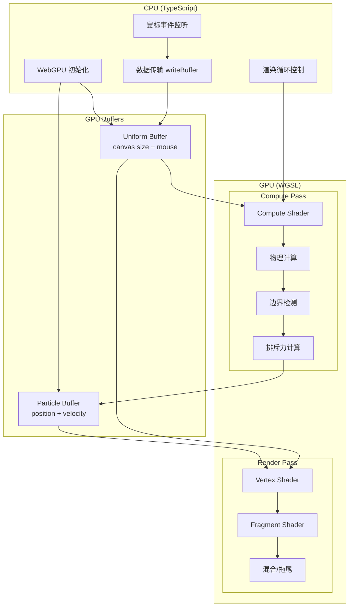

# Design Document: WebGPU Particle Fluid Simulation

## Overview

本设计文档描述了一个基于 WebGPU 的高性能粒子流体模拟系统。系统利用 GPU 的并行计算能力，通过 Compute Shader 实现万级粒子的实时物理模拟，并通过 Render Pipeline 将粒子渲染到屏幕上。

核心架构采用异构计算模式：
- **CPU (Host)**: 负责初始化、事件处理、数据传输协调
- **GPU (Device)**: 负责粒子物理计算和渲染

## Architecture



## Components and Interfaces

### 1. WebGPU 初始化模块

```typescript
interface WebGPUContext {
  adapter: GPUAdapter;
  device: GPUDevice;
  context: GPUCanvasContext;
  format: GPUTextureFormat;
  canvas: HTMLCanvasElement;
}

async function initWebGPU(): Promise<WebGPUContext> {
  // 1. 请求 adapter
  // 2. 请求 device
  // 3. 配置 canvas context
  // 4. 返回上下文对象
}
```

### 2. Buffer 管理模块

```typescript
interface ParticleBuffers {
  particleBuffer: GPUBuffer;      // Storage buffer for particle data
  uniformBuffer: GPUBuffer;       // Uniform buffer for global params
}

interface Particle {
  x: number;      // position x
  y: number;      // position y
  vx: number;     // velocity x
  vy: number;     // velocity y
}

interface Uniforms {
  width: number;
  height: number;
  mouseX: number;
  mouseY: number;
}
```

### 3. Pipeline 模块

```typescript
interface Pipelines {
  computePipeline: GPUComputePipeline;
  renderPipeline: GPURenderPipeline;
  computeBindGroup: GPUBindGroup;
  renderBindGroup: GPUBindGroup;
}
```

### 4. 渲染循环模块

```typescript
interface RenderLoop {
  start(): void;
  stop(): void;
  updateMousePosition(x: number, y: number): void;
}
```

## Data Models

### Particle Data Layout (Storage Buffer)

每个粒子占用 16 字节 (4 x float32):

```
Offset  | Size | Field    | Description
--------|------|----------|-------------
0       | 4    | x        | Position X
4       | 4    | y        | Position Y
8       | 4    | vx       | Velocity X
12      | 4    | vy       | Velocity Y
```

总 Buffer 大小: `PARTICLE_COUNT * 16` 字节

### Uniform Data Layout

```
Offset  | Size | Field    | Description
--------|------|----------|-------------
0       | 4    | width    | Canvas width
4       | 4    | height   | Canvas height
8       | 4    | mouseX   | Mouse X position
12      | 4    | mouseY   | Mouse Y position
```

总大小: 16 字节

### WGSL Struct 定义

```wgsl
struct Particle {
  position: vec2f,
  velocity: vec2f,
}

struct Uniforms {
  canvasSize: vec2f,
  mousePos: vec2f,
}
```

## Shader Design

### Compute Shader

```wgsl
@group(0) @binding(0) var<storage, read_write> particles: array<Particle>;
@group(0) @binding(1) var<uniform> uniforms: Uniforms;

@compute @workgroup_size(64)
fn main(@builtin(global_invocation_id) id: vec3u) {
  let index = id.x;
  if (index >= arrayLength(&particles)) { return; }
  
  var p = particles[index];
  
  // 1. 应用重力
  let gravity = vec2f(0.0, 0.1);
  p.velocity += gravity;
  
  // 2. 鼠标排斥力
  let toMouse = uniforms.mousePos - p.position;
  let dist = length(toMouse);
  if (dist < 200.0 && dist > 0.0) {
    let force = normalize(toMouse) * (-50.0 / dist);
    p.velocity += force;
  }
  
  // 3. 更新位置
  p.position += p.velocity;
  
  // 4. 边界反弹
  if (p.position.x < 0.0 || p.position.x > uniforms.canvasSize.x) {
    p.velocity.x *= -0.9;
    p.position.x = clamp(p.position.x, 0.0, uniforms.canvasSize.x);
  }
  if (p.position.y < 0.0 || p.position.y > uniforms.canvasSize.y) {
    p.velocity.y *= -0.9;
    p.position.y = clamp(p.position.y, 0.0, uniforms.canvasSize.y);
  }
  
  particles[index] = p;
}
```

### Vertex Shader

```wgsl
struct VertexOutput {
  @builtin(position) position: vec4f,
  @location(0) speed: f32,
}

@group(0) @binding(0) var<storage, read> particles: array<Particle>;
@group(0) @binding(1) var<uniform> uniforms: Uniforms;

@vertex
fn main(@builtin(vertex_index) vertexIndex: u32) -> VertexOutput {
  let p = particles[vertexIndex];
  
  // 转换到 NDC 坐标 (-1 to 1)
  let ndc = (p.position / uniforms.canvasSize) * 2.0 - 1.0;
  
  var output: VertexOutput;
  output.position = vec4f(ndc.x, -ndc.y, 0.0, 1.0);
  output.speed = length(p.velocity);
  return output;
}
```

### Fragment Shader

```wgsl
@fragment
fn main(@location(0) speed: f32) -> @location(0) vec4f {
  // 基于速度的颜色渐变 (cyan -> purple)
  let t = clamp(speed / 10.0, 0.0, 1.0);
  let cyan = vec3f(0.0, 1.0, 1.0);
  let purple = vec3f(0.8, 0.2, 1.0);
  let color = mix(cyan, purple, t);
  let brightness = 0.5 + t * 0.5;
  return vec4f(color * brightness, 1.0);
}
```

## Trail Effect Implementation

拖尾效果通过以下方式实现：

1. **不清除画布**: Render Pass 的 `loadOp` 设为 `'load'`
2. **半透明覆盖**: 每帧先绘制一个全屏半透明黑色矩形

```typescript
// Trail fade quad pipeline
const trailPipeline = device.createRenderPipeline({
  // ... 配置全屏四边形渲染
  fragment: {
    // 输出 rgba(0, 0, 0, 0.05)
  },
  primitive: { topology: 'triangle-strip' },
  blend: {
    color: { srcFactor: 'src-alpha', dstFactor: 'one-minus-src-alpha' },
    alpha: { srcFactor: 'one', dstFactor: 'one' },
  },
});
```


## Correctness Properties

*A property is a characteristic or behavior that should hold true across all valid executions of a system—essentially, a formal statement about what the system should do. Properties serve as the bridge between human-readable specifications and machine-verifiable correctness guarantees.*

### Property 1: Particle Data Layout Consistency

*For any* particle read from the GPU buffer, the data should be interpretable as four consecutive 32-bit floats representing (x, y, vx, vy) in that exact order.

**Validates: Requirements 2.2**

### Property 2: Particle Initialization Bounds

*For any* particle after initialization, its position (x, y) should satisfy: `0 <= x <= canvasWidth` and `0 <= y <= canvasHeight`.

**Validates: Requirements 2.3**

### Property 3: Physics Update Correctness

*For any* particle not at a boundary, after one compute shader execution:
- `new_position = old_position + old_velocity + gravity`
- `new_velocity = old_velocity + gravity`

where gravity = vec2(0.0, 0.1).

**Validates: Requirements 3.1, 3.4**

### Property 4: Boundary Bounce Behavior

*For any* particle whose position would exceed canvas bounds after a physics update:
- The position should be clamped to the valid range [0, canvasSize]
- The velocity component perpendicular to the boundary should be negated (with optional damping factor)

**Validates: Requirements 3.2**

### Property 5: Repulsion Force Application

*For any* particle within 200 pixels of the mouse cursor:
- A repulsion force should be applied in the direction away from the cursor
- The force magnitude should be inversely proportional to distance: `force ∝ 1/distance`
- Particles farther from the cursor (but still within 200px) should receive weaker forces

*For any* particle beyond 200 pixels from the mouse cursor:
- No repulsion force should be applied

**Validates: Requirements 4.2, 4.3**

### Property 6: Velocity-Based Color Mapping

*For any* particle with velocity v:
- The color should be computed as `mix(cyan, purple, t)` where `t = clamp(|v| / 10.0, 0, 1)`
- Particles with zero velocity should be cyan (0, 1, 1)
- Particles with velocity magnitude >= 10 should be purple (0.8, 0.2, 1.0)
- The brightness should increase with velocity: `brightness = 0.5 + t * 0.5`

**Validates: Requirements 5.2, 5.3**

## Error Handling

### WebGPU Initialization Errors

| Error Condition | Handling Strategy |
|-----------------|-------------------|
| WebGPU not supported | Display user-friendly message, suggest Chrome/Edge |
| Adapter request fails | Log error, show fallback message |
| Device request fails | Log error with reason, show fallback message |
| Canvas context fails | Log error, attempt recovery |

### Runtime Errors

| Error Condition | Handling Strategy |
|-----------------|-------------------|
| Buffer creation fails | Log error, reduce particle count and retry |
| Shader compilation fails | Log WGSL errors, halt execution |
| Device lost | Attempt re-initialization |
| Out of memory | Reduce particle count, warn user |

### Error Display

```typescript
function showError(message: string): void {
  const errorDiv = document.createElement('div');
  errorDiv.style.cssText = `
    position: fixed; top: 50%; left: 50%;
    transform: translate(-50%, -50%);
    background: #1a1a2e; color: #ff6b6b;
    padding: 20px; border-radius: 8px;
    font-family: monospace;
  `;
  errorDiv.textContent = message;
  document.body.appendChild(errorDiv);
}
```

## Testing Strategy

### Unit Tests

Unit tests will verify specific examples and edge cases:

1. **WebGPU Initialization**
   - Test adapter/device acquisition succeeds
   - Test canvas context configuration
   - Test error handling when WebGPU unavailable

2. **Buffer Management**
   - Test buffer creation with correct size
   - Test particle data initialization
   - Test uniform buffer updates

3. **Shader Compilation**
   - Test compute shader compiles without errors
   - Test render shaders compile without errors

### Property-Based Tests

Property-based tests will use **fast-check** library for TypeScript to verify universal properties across many generated inputs.

Configuration:
- Minimum 100 iterations per property test
- Each test tagged with: **Feature: webgpu-particle-fluid-sim, Property {N}: {description}**

**Test Implementation Approach:**

Since GPU shader logic cannot be directly unit tested in Node.js, we will:
1. Extract pure mathematical functions (physics, color mapping) into testable TypeScript modules
2. Test these functions with property-based testing
3. Use the same logic in WGSL shaders (manual verification of equivalence)

```typescript
// Example: Testable physics module
export function updateParticle(
  particle: Particle,
  gravity: Vec2,
  canvasSize: Vec2,
  mousePos: Vec2
): Particle {
  // Same logic as WGSL shader, but in TypeScript
}

// Property test
fc.assert(
  fc.property(
    particleArbitrary,
    canvasSizeArbitrary,
    (particle, canvasSize) => {
      const result = updateParticle(particle, GRAVITY, canvasSize, NO_MOUSE);
      return result.x >= 0 && result.x <= canvasSize.x &&
             result.y >= 0 && result.y <= canvasSize.y;
    }
  ),
  { numRuns: 100 }
);
```

### Integration Tests

1. **Render Loop Integration**
   - Verify compute pass executes before render pass
   - Verify frame timing is consistent

2. **Mouse Interaction**
   - Verify mouse events update uniform buffer
   - Verify particles respond to mouse position

### Visual Verification (Manual)

Some aspects require manual visual verification:
- Trail effect appearance
- Color gradient aesthetics
- Overall simulation feel
